# Lab Infrastructure Project: SQL Server 2025 & Domain Integration

## Introduction
This laboratory project provides a detailed technical documentation of building a secure and scalable enterprise-like network environment from the ground up. The primary objective is to demonstrate the integration of IT infrastructure components, specifically focusing on four key technical domains:

1. **Network Foundation:** Establishing reliable connectivity through static IP addressing and robust DNS name resolution.
2. **Centralized Identity Management:** Integrating a client workstation into an Active Directory domain to enable secure authentication and centralized resource management.
3. **Database Server Provisioning:** Deploying a Microsoft SQL Server 2025 instance, including complex service account configuration and security policy hardening.
4. **Administrative Operations:** Finalizing the environment by deploying remote management tools (SSMS) and verifying operational readiness through successful database connectivity.

---

## Prerequisites
Before beginning the deployment, ensure the following environment requirements are met:
* **Infrastructure:** Domain Controller (Windows Server 2025) running Active Directory Domain Services (AD DS) and a Client Workstation (Windows 10/11).
* **Network Connectivity:** Virtual or physical isolation ensuring the client and server can communicate via the specified IP range ($192.168.1.0/24$).
* **Installation Media:** Valid Windows Server/SQL Server 2025 installation images and the SSMS installer.

---

## 1. Network Configuration
* **Static IP & DNS Setup**
    * **What it does:** Assigns a fixed IP address ($192.168.1.11$) to the workstation and configures the DNS settings to point to the Domain Controller ($192.168.1.10$).
    * **Why it is necessary:** A static identity is required for consistent network communication, and proper DNS resolution is critical for the client to locate domain services.

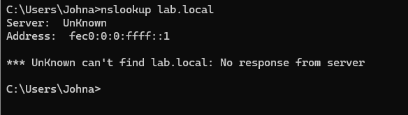
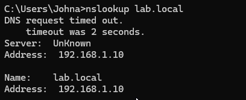

## 2. Active Directory Domain Integration
* **Workstation Domain Join**
    * **What it does:** Migrates the "James" workstation from a local workgroup environment into the `lab.local` Active Directory domain.
    * **Why it is necessary:** Domain membership allows for centralized authentication, group policy management, and resource access control.

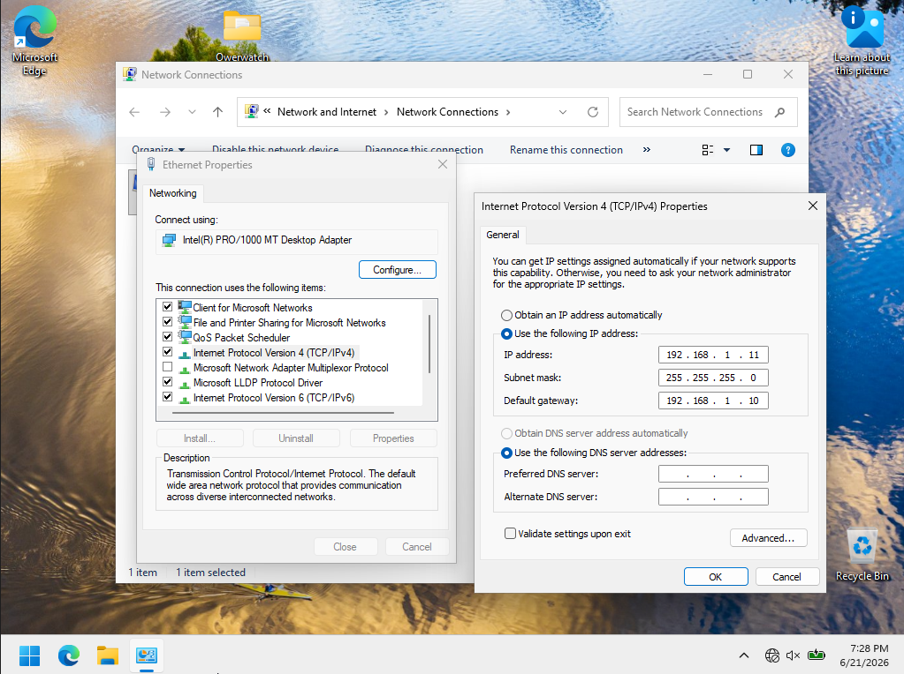
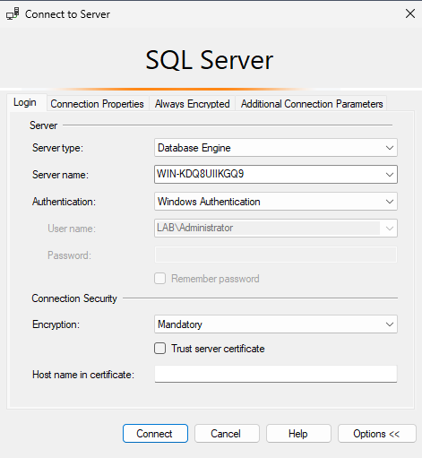
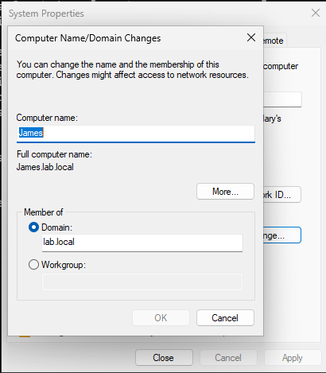

* **Troubleshooting Connectivity**
    * **What it does:** Diagnoses and resolves Active Directory communication constraints during the domain binding phase.
    * **Why it is necessary:** Ensuring a healthy trust relationship between the client and the controller is mandatory for secure network operation.

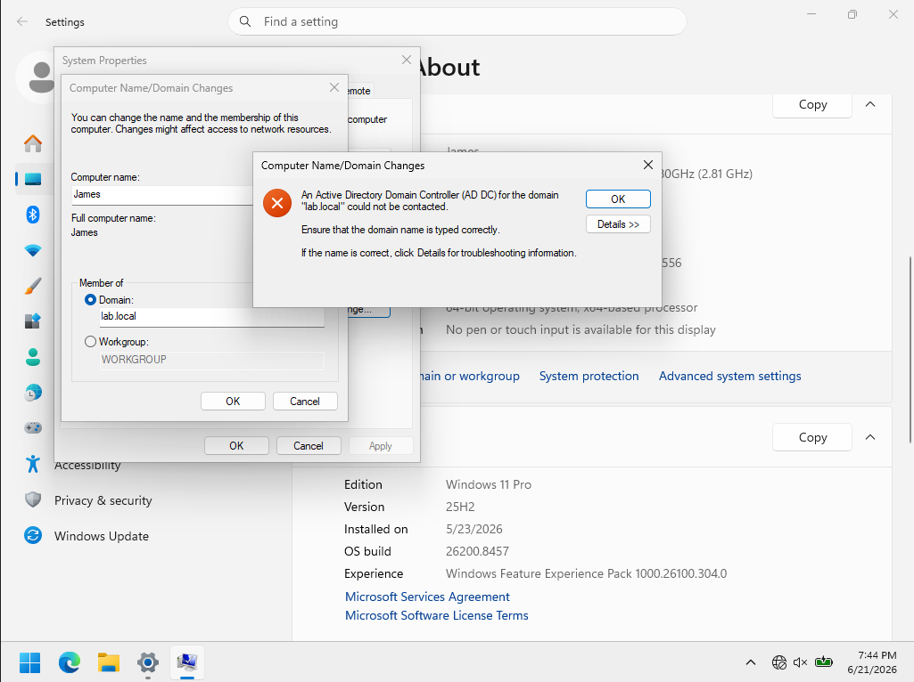
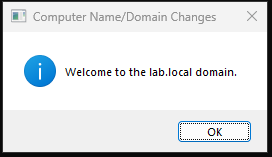

## 3. SQL Server 2025 Deployment
* **Initialization & Prerequisites**
    * **What it does:** Executes the installer to verify system compatibility and prepare the environment for database services.
    * **Why it is necessary:** Establishing the database engine foundation is the first step in enabling enterprise data management.

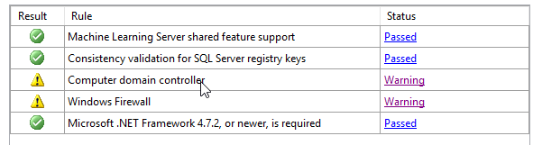

**Clarification on Warnings:** You may notice yellow warning icons regarding the "Computer domain controller" and "Windows Firewall." These are expected in this lab environment and are not critical errors. These warnings do not affect the functionality of this virtualized lab setup, and you can safely proceed with the installation.

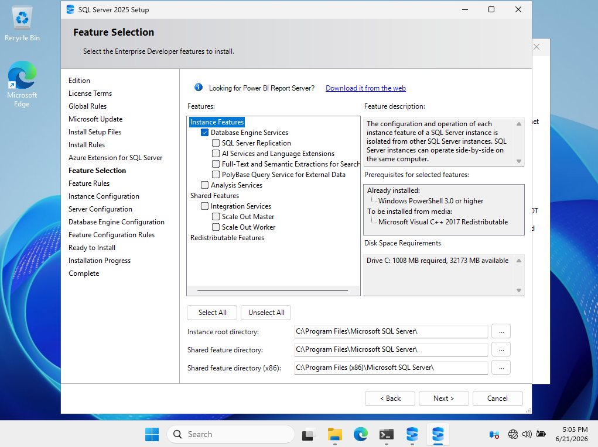

* **Service Account & Authentication Strategy**
    * **What it does:** Defines startup privileges for SQL services and enables "Mixed Mode" authentication.
    * **Why it is necessary:** Mixed Mode provides the flexibility to support both domain-joined Windows accounts and native SQL application logins.

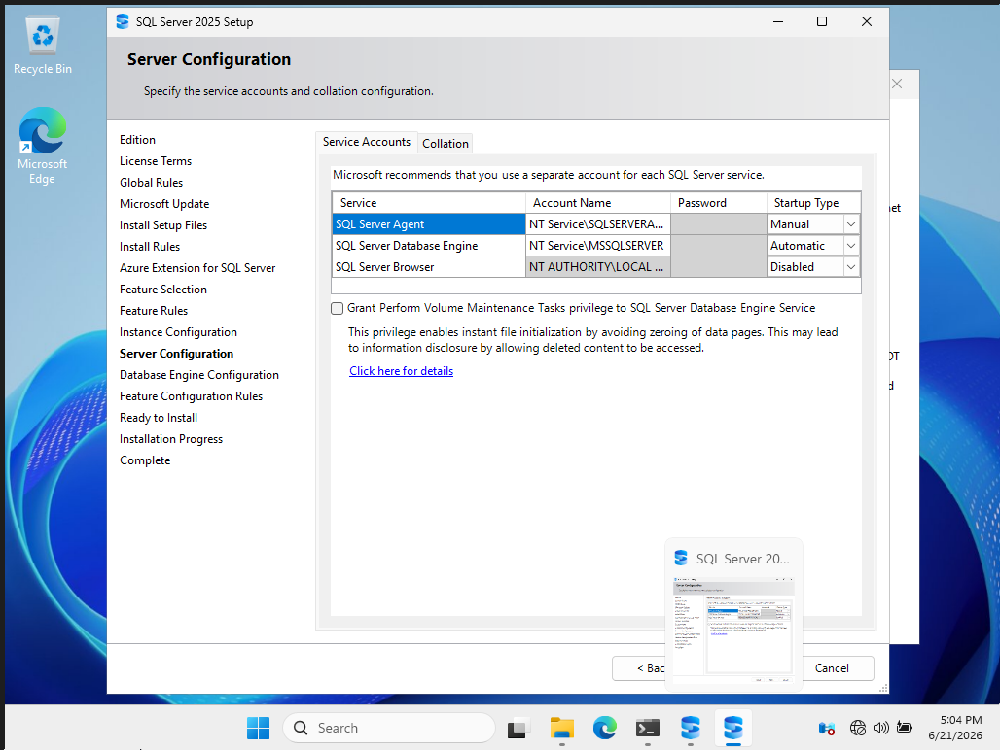
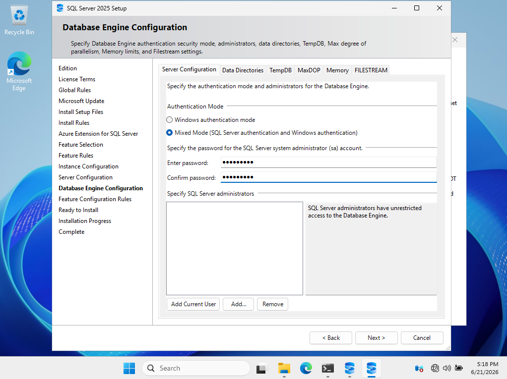

* **Installation Process**
    * **What it does:** Extracts and deploys the core SQL Server engine components.
    * **Why it is necessary:** Completes the transition from installation binaries to a fully functional database instance.

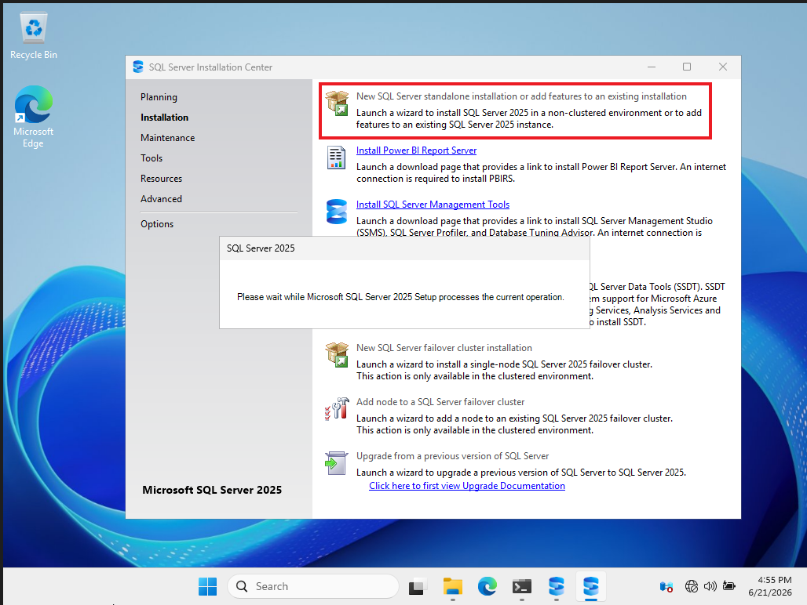
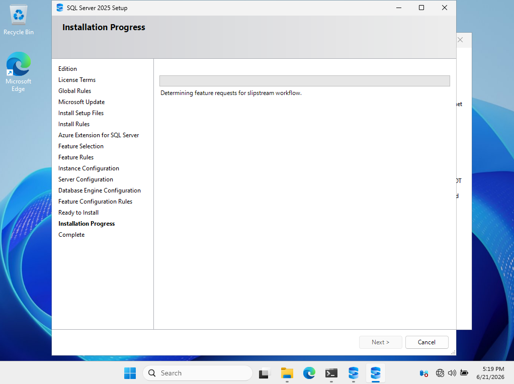
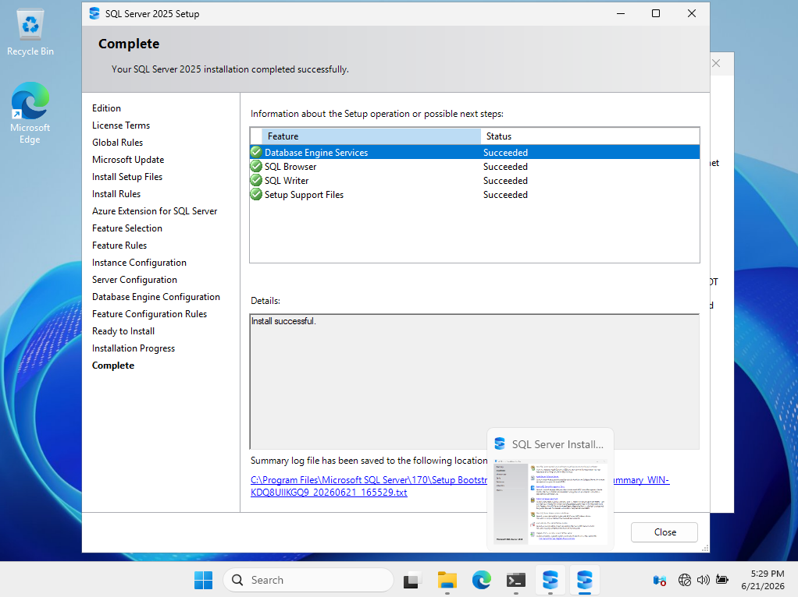

## 4. Administrative Management & Troubleshooting
* **Management Studio Installation**
    * **What it does:** Installs SQL Server Management Studio (SSMS) on the client workstation.
    * **Why it is necessary:** SSMS is the primary administrative interface required to perform database queries, server configuration, and monitoring.

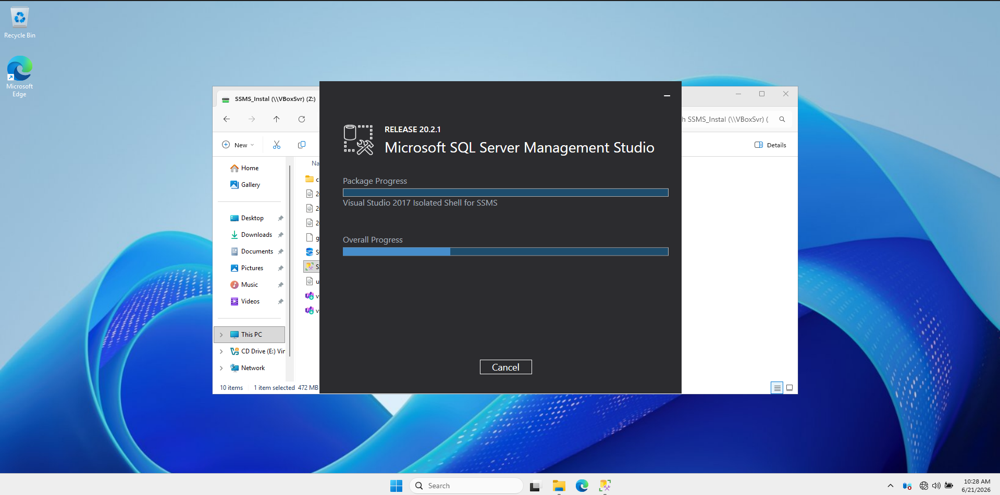

* **Troubleshooting Connectivity**
    * **Step 1:** Check if TCP/IP is enabled.
        
    * **Step 2:** Test connection and address firewall issues.
        
    * **Step 3:** Configure new firewall rule.
        
        
        
        
    * **Step 4:** Policy update and final verification.
        
        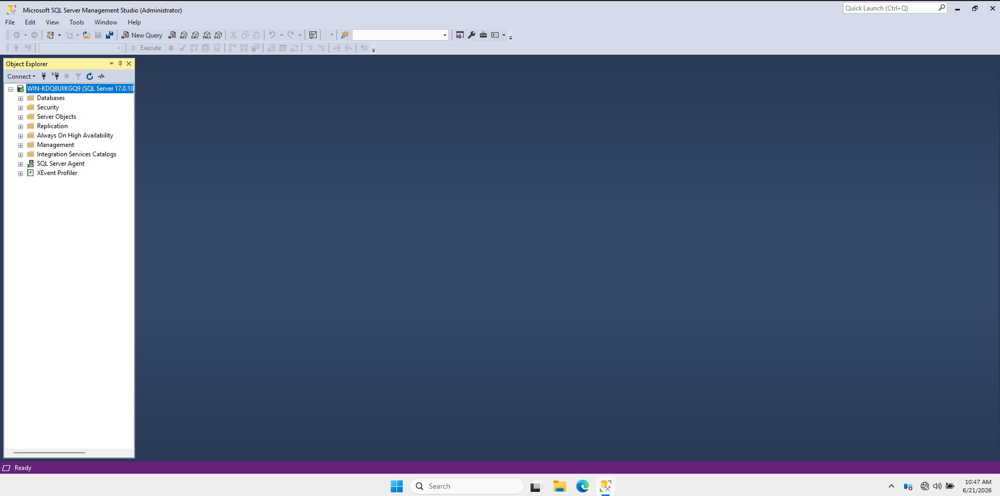

---

## 5. Technical Summary
| Component | Configuration Value |
| :--- | :--- |
| **Domain Name** | `lab.local` |
| **Domain Controller IP** | `192.168.1.10` |
| **Workstation IP** | `192.168.1.11` |
| **SQL Auth Mode** | Mixed Mode (Windows + SQL) |
| **Admin Account** | `sa` (System Administrator) |

---

## Conclusion
This project successfully demonstrates the systematic deployment of a functional SQL Server environment within a domain-controlled network. By following these steps—from network configuration and Active Directory integration to service deployment and remote management—we have created a robust foundation for database administration.

> **Security Best Practice:** In a production environment, always ensure the `sa` account uses a highly complex, unique password and consider disabling SQL authentication in favor of Windows-only authentication where business requirements permit.
